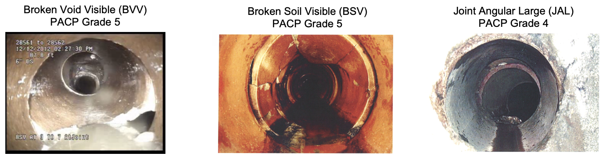
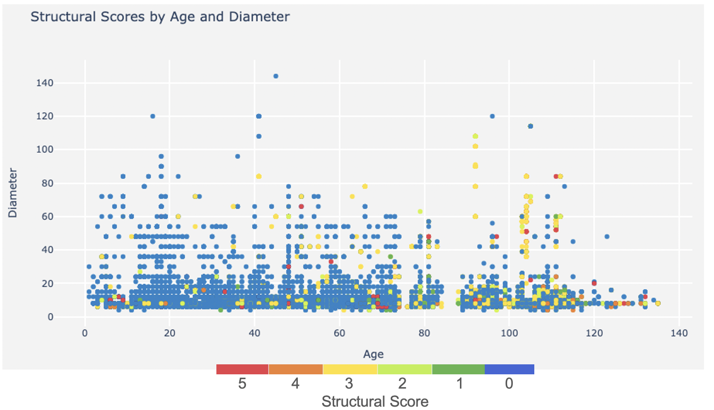
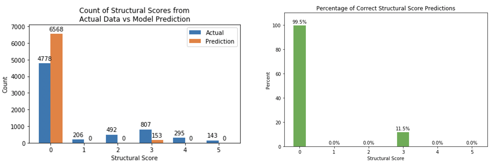

# Predicting Utility Pipe Structural Scores

### Research Question
Can material type, age, length, and operational score be used to predict the structural score of a utility pipe?

### Motivation
Cities maintain intricate networks of gravity pipes which convey wastewater and drainage. This infrastructure is critical to maintaining public health and safety; failures can be catastrophic in terms of construction costs, property damage, and impacts to daily operations.

Currently, maintenance workers manually log a structural score based on visual analysis of CCTV recordings. This process is time consuming and it is nearly impossible to get full coverage in a network with over 100,000 pipes. Using machine learning to predict pipe defects could help fill in null values, reduce maintenance crew workload, and help prioritize maintenance.

### Data Source
City of Sacramento pipe data

### Method
* Predictors:
    * Age
    * Length
    * System Type
    * Material Type
    * Operational Score
* Target: Structural Score (0-5)
* Machine Learning Model: Decision Tree Classifier

### Findings
Age and Structural Score were positively correlated. The correlation is not strong however as red dots (Structural Score = 5) are dispersed throughout.

### Conclusion
The classifier achieved an accuracy of 72% but was only predicting 0s and 3s. As the higher scores are more critical to identify, this model, as is, could not replace manual, visual inspection.

### Limitations
Data:
Utilities obviously try to fix pipes in a timely manner. Because this dataset consisted solely of pipes currently in the system, it was imbalanced towards pipes with low structural scores. Historic data of pipes that were replaced would improve the imbalance.

Experience:
As my first project in data science, I was not aware of the full breadth of model options. Being close to completing my Masters program, I now would be able to perform a model selection process, hyperparameter search, and address the imbalanced data.